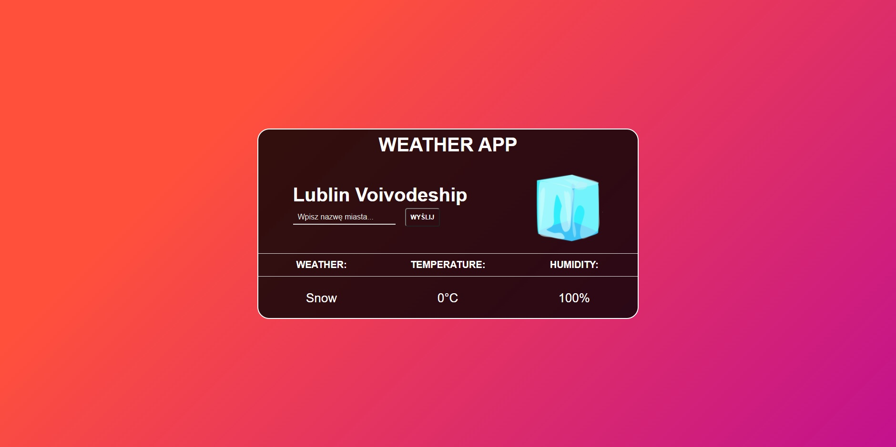

# Strona Weather App
[link do strony](https://rafalbalinski.github.io/WeatherApp/)

## O Projekcie
Aplikacja Webowa sprawdzająca pogodę w podanym przez użytkownika mieście. Dane są pobierane z zewnętrznego api oraz przetwarzane za pomocą JavaScript.

## Narzędzia
- HTML5
- CSS3
- JS ES6
  
